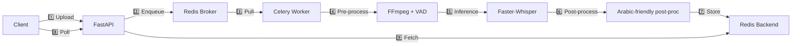

# 🎙️ Tunisian Darija STT Micro‑service

*A production‑ready, distributed Speech‑to‑Text API built for Tunisian Darija (Arabic dialect) and Arabizi.*

<div align="center">

[](https://www.python.org)
[](https://fastapi.tiangolo.com)
[](https://docs.celeryq.dev/)
[](https://redis.io/)
[](https://www.docker.com)
[](https://huggingface.co/Systran/faster-whisper-base)

</div>

---

## 📖 Table of Contents
1. [Overview](#overview)
2. [Features](#features)
3. [Architecture](#architecture)
4. [Repository Layout](#repository-layout)
5. [Installation & Quick‑Start](#installation--quick-start)
6. [API Reference](#api-reference)
7. [Configuration](#configuration)
8. [License](#license)

---

## Overview

This micro‑service exposes an **asynchronous REST API** for transcribing audio files written in Tunisian Darija or Arabizi. It combines:

- **Faster‑Whisper** (CTranslate2) – fast, low‑memory Whisper inference, works on CPU and GPU.
- **Celery + Redis** – robust background task queue so the API returns instantly with a `task_id`.
- **FastAPI** – modern, high‑performance HTTP framework with automatic docs (Swagger UI).

The pipeline includes audio normalisation (FFmpeg), voice‑activity detection, transcription, and a lightweight rule‑based **Arabic‑friendly post‑processing** that adds proper punctuation and guarantees right‑to‑left rendering.

---

## Features

| Feature | Implementation | Why it matters |
|---|---|---|
| **Async processing** | Celery + Redis | Immediate response, scale workers independently |
| **GPU/CPU inference** | Faster‑Whisper (CTranslate2) | Up to 4× speed‑up vs. vanilla Whisper |
| **Audio normalisation** | FFmpeg + webrtcvad | Handles any input format, removes silence/hum |
| **Arabic‑aware post‑processing** | Custom `postprocessing.py` | Capitalises, adds Arabic commas `،`, strips invisible bidi symbols |
| **Docker‑first** | Docker‑Compose + Dockerfile | One‑command local & production setup |
| **Swagger docs** | FastAPI auto‑generated | Easy testing via `/docs` |
| **Config via env** | Pydantic `Settings` | No code changes required for different environments |

---

## Architecture



- **FastAPI** never blocks; it only queues tasks.
- **Celery workers** can be horizontally scaled.
- **Redis** stores both the broker queue and the final transcription payload.

---

## Repository Layout

```
.
├── api/
│   └── main.py               # FastAPI endpoints & router
├── common/
│   ├── logger.py              # Loguru wrapper
│   └── settings.py            # Pydantic‑based env configuration
├── worker/
│   ├── celery_app.py          # Celery instance
│   ├── tasks.py               # `transcribe_task`
│   └── pipeline/
│       ├── model_manager.py   # Singleton Whisper model loader
│       ├── preprocessing.py   # FFmpeg + VAD helper
│       ├── inference.py       # Speech‑to‑Text execution logic
│       └── postprocessing.py  # Arabic‑friendly text cleanup
├── docker-compose.yml         # Redis + API + worker services
├── Dockerfile                 # Base image (Python‑3.11) used by API & worker
├── download_tiny_model.py     # Helper to pre‑cache the HuggingFace model
├── requirements.txt           # Python dependencies
└── README.md                  # (this file)
```

---

## Installation & Quick‑Start

### Prerequisites
- **Docker & Docker‑Compose** (recommended for a reproducible dev environment)
- *(Optional)* **NVIDIA Container Toolkit** if you want GPU acceleration

### Option A – Docker Compose (recommended for everyone)

```bash
# 1️⃣ Clone the repo
git clone https://github.com/ben-slimene-nour-el-houda/STT.git
cd STT

# 2️⃣ Build images and start all services in detached mode
docker‑compose up -d --build
```

**Verify the stack**
```bash
# Follow the worker logs – you’ll see the model being loaded the first time
docker‑compose logs -f worker
```

The API will be reachable at `http://localhost:8000`. Swagger UI is available at `http://localhost:8000/docs`.

### Option B – Local Development (no Docker)

```bash
# 1️⃣ Create a virtual environment
python3 -m venv venv
source venv/bin/activate

# 2️⃣ Install Python dependencies
pip install -r requirements.txt

# 3️⃣ (Optional) Pre‑download the Whisper model to avoid the first‑run download delay
python download_tiny_model.py
```

Open three terminals (or use a tmux/pane layout):

```bash
# Terminal 1 – Redis broker
docker run -d --name stt_redis -p 6379:6379 redis:7-alpine
```
```bash
# Terminal 2 – FastAPI gateway
uvicorn api.main:app --host 0.0.0.0 --port 8000 --reload
```
```bash
# Terminal 3 – Celery worker
celery -A worker.celery_app worker --loglevel=info --concurrency=1
```

### Test the service
```bash
# Submit an audio file (replace voice.wav with your own file)
curl -X POST http://localhost:8000/transcribe \
     -H "X-API-KEY: testkey" \
     -F "file=@voice.wav" -s | jq .

# Poll for the result (replace <TASK_ID>)
while true; do
    curl -s http://localhost:8000/status/<TASK_ID> -H "X-API-KEY: testkey" | jq .
    sleep 2
done
```
The `transcription` field will contain clean Arabic text (e.g., `مرحبًا بك في مشروعنا.`).

---

## API Reference

All endpoints require the HTTP header `X-API-KEY: <your‑key>` (default `testkey`).

| Method | Path | Description | Example Response |
|---|---|---|---|
| `GET` | `/health` | Simple health check | `{ "status": "ok" }` |
| `POST` | `/transcribe` | Upload an audio file; returns a `task_id` instantly. | `{ "task_id": "…", "detail": "Transcription task submitted" }` |
| `GET` | `/status/{task_id}` | Poll task status. Returns `PENDING`, `STARTED`, `SUCCESS` or `FAILURE`. On `SUCCESS` the `result` field contains the JSON payload with `transcription` and `source_file`. | `{ "task_id": "…", "status": "SUCCESS", "result": { "transcription": "…", "source_file": "uploads/…wav" } }` |
| `GET` | `/transcribe_html/{task_id}` | Render the transcription in an HTML page (`dir="rtl"`). Useful for quick visual verification. | *HTML page* |

---

## Configuration

Configuration is handled by **pydantic‑settings** (`common/settings.py`). All variables can be overridden via environment variables or a `.env` file placed at the repository root.

| Variable | Meaning | Default |
|---|---|---|
| `REDIS_URL` | Connection string for Redis broker/backend | `redis://localhost:6379/0` |
| `API_KEYS` | Comma‑separated list of valid API keys | `testkey` |
| `RATE_LIMIT_TOKENS` / `RATE_LIMIT_INTERVAL` | Simple token‑bucket rate‑limiter | `10` / `60` seconds |
| `UPLOAD_DIR` | Directory (mounted volume) for temporary audio uploads | `./uploads` |
| `MODEL_DEVICE` | `cpu`, `cuda`, or `auto` (auto‑detect) | `cpu` |
| `STT_MODEL_SIZE` | Model size to load (`tiny`, `base`, `small`, `medium`, `large`) – **default `base`** for good Arabic accuracy | `base` |
| `ENABLE_LLM` | Whether to enrich the transcription with an LLM (requires extra service) | `false` |

### Example `.env`
```
REDIS_URL=redis://redis:6379/0
API_KEYS=my-secret-key,another-key
MODEL_DEVICE=auto
STT_MODEL_SIZE=base
UPLOAD_DIR=/app/uploads
```

---

## License

MIT License – see the `LICENSE` file.

---

<div align="center">

*Built with ❤️ for Tunisian Arabic because dialect matters.*

</div>
